<!-- ╔══════════════════════════════════════════════════════════════╗ -->
<!-- ║   IMMERSIVE CANVAS  (matrix rain background + all content)     ║ -->
<!-- ╚══════════════════════════════════════════════════════════════╝ -->

  

<!-- ╔══════════════════════════════════════════════════════════════╗ -->
<!-- ║   htop — recently pushed repos (real GitHub data)             ║ -->
<!-- ╚══════════════════════════════════════════════════════════════╝ -->

  

<!-- ╔══════════════════════════════════════════════════════════════╗ -->
<!-- ║   git activity capture (real repos, languages, stars)         ║ -->
<!-- ╚══════════════════════════════════════════════════════════════╝ -->

  

